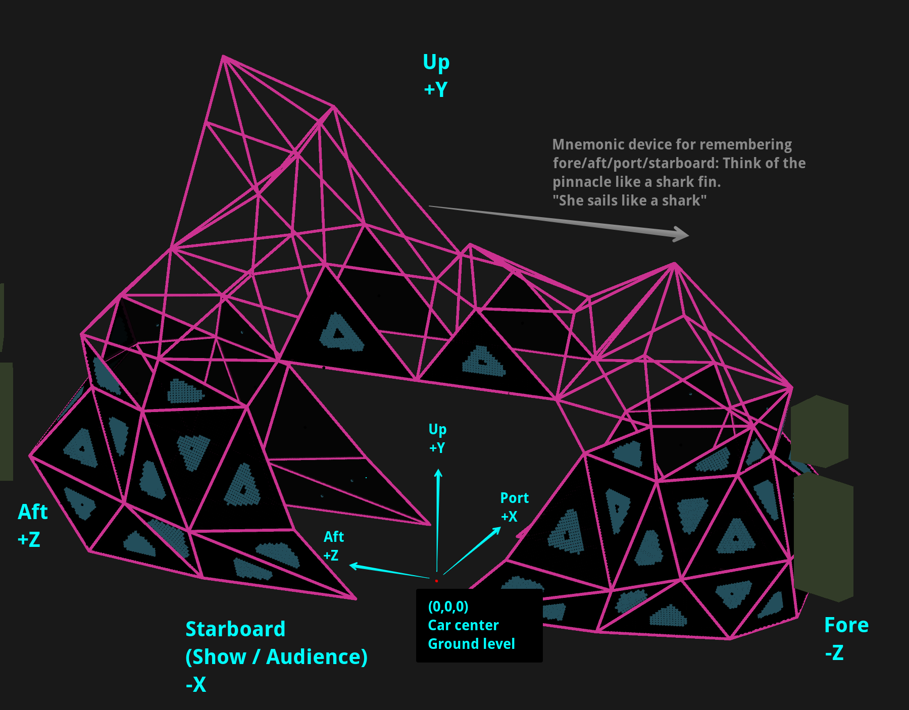
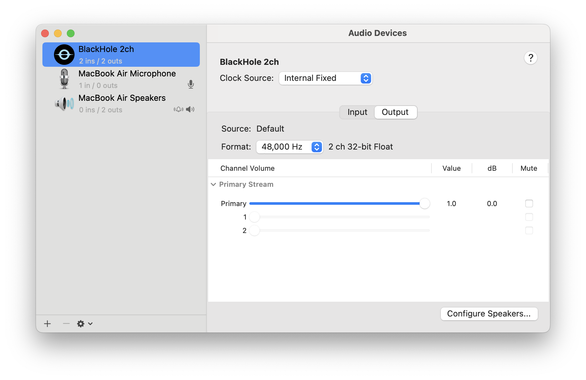
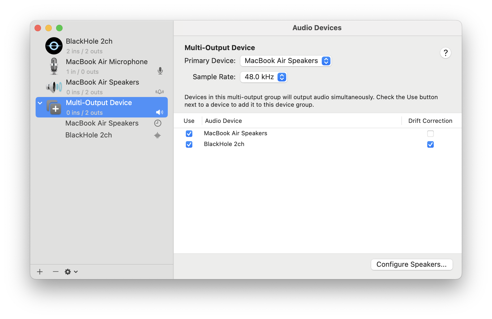
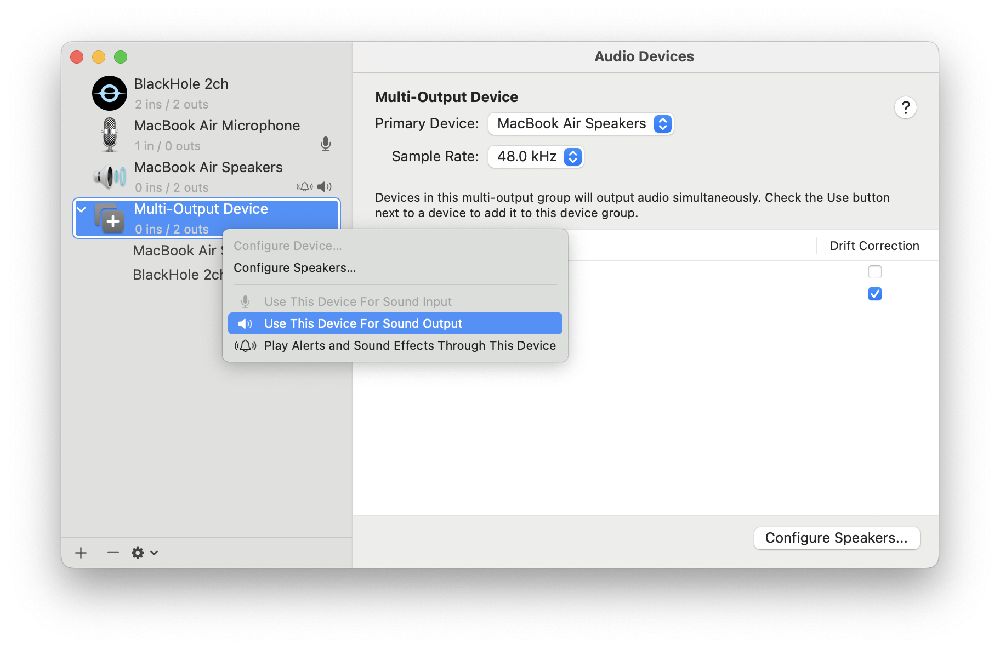
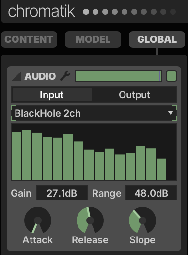
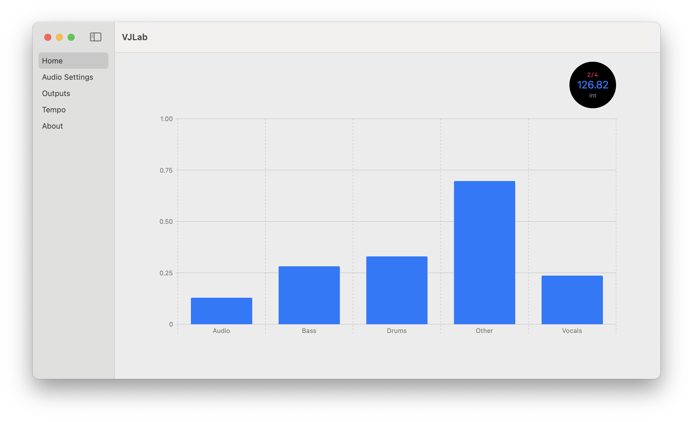
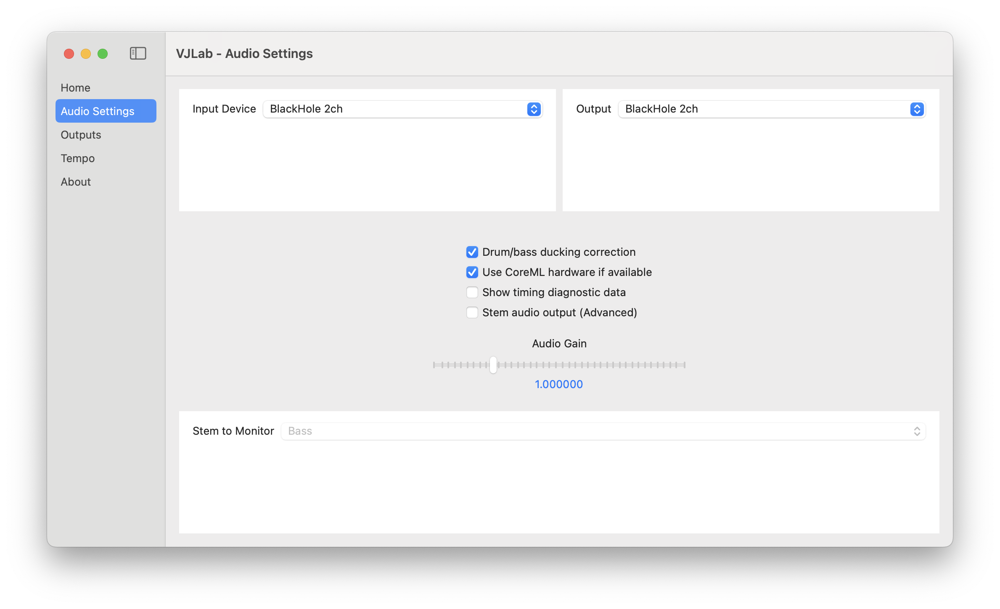
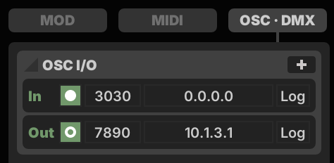

## Titanic's End LXStudio

[Titanic's End](http://titanicsend.com) is a mutant vehicle that debuted at [Burning Man](https://burningman.org) 2022
and has since participated in EDC and Framework events.

We are the largest team developing on Chromatik in the open so other artists can benefit from our work (see
the [license](LICENSE.md)). This repo contains the shader & pattern code for the 128,000 LEDS, sound reactivity, MIDI
control, OSC middleware, and ArtNet bidirectional control.

We use [Chromatik](https://chromatik.co/) (formerly known as [LX Studio](https://lx.studio/)) to control the show.
Although not required, we also support Chromatik financially because it's excellent. This README will get you up and
running with it so you, too, can create stunning LED art.

Our work is notable for:

- GLSL shader support
- Developed to team-friendly maintainability standards for long-term enjoyment of the codebase
- AutoVJ - an autopilot that uses Pioneer Rekordbox's phrase and beat analysis to change patterns when a human VJ would
- GigglePixel, Pixelblaze, and ArtNet integration

Want a personal intro to the project and codebase? Contact current team
lead [Andrew Look](https://github.com/andrewlook) by messaging andrew-m-look (s/-/./g) electronically at the big Gm.com
thing.

<details>
    <summary>What if I want to know more?</summary>
    <p>This doc sets out the project vision and has much more information: <a href="https://docs.google.com/document/d/1YK9umrhOodwnRWGRzYOR1iOocrO6Cf9ZpHF7FWgBKKI/edit#">2022 Lighting Design Doc</a></p>
    <p>Team members can reference several docs on our Notion for more background including <a href="https://www.notion.so/titanicsend/Networking-and-Front-of-House-Setup-fe5360a00b594955b735e02115548ff4">Networking and Front of House</a> and <a href="https://www.notion.so/titanicsend/2023-Lighting-Software-Integration-61c9cd5c6e884c6db66d4f843a1b8812">Software / Integration Hub</a>.</p>
</details>

## JDK Installation

Visit https://adoptium.net/installation/ or if you are using macOS and [Homebrew](https://brew.sh) use these commands:

```sh
brew uninstall --cask temurin # ensure you are running 21
brew install --cask temurin@21
```

Verify your installation:

```
/Library/Java/JavaVirtualMachines/temurin-21.jdk/Contents/Home/bin/java --version
```

After installing the temurin JDK, we recommend installing and building maven, a package manager for our project:

```sh
brew install maven
```

Clean and install the maven dependencies:

```sh
mvn clean -U package && mvn install
```

One more thing… we have a coding style setup, as described below, so you’ll also need to
install [google-java-format](https://github.com/google/google-java-format):

```sh
brew install google-java-format
```

## Quick Start

> These are geared toward running Chromatik on macOS with `git` already installed. If you need help with anything, ask
> in the Slack #lighting-software channel!

First, you'll need an IDE (editor). IntelliJ's Community Edition is the best free one available. You can download it
[here](https://www.jetbrains.com/idea/).

Steps for setup:

1. Clone the git repo you're looking at:

   ```sh
   git clone https://github.com/titanicsend/LXStudio-TE.git
   ```

2. Open the project directory you cloned to when you're presented with "New Project" and
   "Open" options. That's the initial screen.

3. File → Project Structure (or ⌘-;)
   

   1. Platform Settings → SDKs

      1. Either add the installed Temurin 21 JDK
      2. Or, if that JDK is not installed, you can click the '+' and then select
         "Add JDK..."
         1. Navigate to `/Library/Java/JavaVirtualMachines/temurin-21.jdk`
         2. Select `temurin-21.jdk`
            
            

   2. Project Settings → Project
      1. Select the Temurin 21 JDK
         

4. Select "Titanic's End Dynamic" in the top bar (in the dropdown to the right of the hammer) if you want to use the
   vehicle
   model.
   

5. Hit the green arrow "play" button. (If you just want to build, you can hit the hammer.)

6. Assuming things work okay, a UI for Chromatik will pop up: Great! Now, you can play with the buttons.

### Coding Style

These are the steps to use [google-java-format](https://github.com/google/google-java-format) automatically
and ensure that each commit gets formatted before being submitted.

1. As mentioned earlier, run the following to ensure you have `google-java-format` installed:

```sh
brew install google-java-format
```

2. Set up the git pre-commit hook to run the `google-java-format` CLI tool on changed files

```sh
cp pre-commit .git/hooks/pre-commit
```

Commits may now fail if there's a style violation on any files modified in that commit, since this runs
`mvn spotless:check`. If you really need to commit something and are okay to fix the lint errors later, you can do a
`git commit --no-verify` just to bypass this check temporarily and save your commit. However, `mvn spotless:check` is
required to pass on any PR's before they're merge-able, so you'll need to make the lint fixes eventually.

You can manually apply formatting fixes using `mvn spotless:apply`. It's easiest, though, to have your code reformatted
by the IDE, every time you save.

(IntelliJ Users) Install this
plugin: [google-java-format plugin](https://github.com/google/google-java-format#intellij-android-studio-and-other-jetbrains-ides)

- The google-java-format plugin uses some internal classes that aren't available without extra configuration. To use the
  plugin, you need to add some options to your IDE's Java runtime. To do that, go to `Help→Edit Custom VM Options...`
  and paste in these lines:

```sh
--add-exports=jdk.compiler/com.sun.tools.javac.api=ALL-UNNAMED
--add-exports=jdk.compiler/com.sun.tools.javac.code=ALL-UNNAMED
--add-exports=jdk.compiler/com.sun.tools.javac.file=ALL-UNNAMED
--add-exports=jdk.compiler/com.sun.tools.javac.parser=ALL-UNNAMED
--add-exports=jdk.compiler/com.sun.tools.javac.tree=ALL-UNNAMED
--add-exports=jdk.compiler/com.sun.tools.javac.util=ALL-UNNAMED
```

- The plugin will be disabled by default. To enable, open the Project settings, then click `google-java-format
 Settings` and check the `Enable google-java-format` checkbox.
- After plugin install, go to `Settings > Tools > Actions on Save` and enable `Reformat Code`
  and `Optimize Imports`.

(Eclipse Users) Or install the IDE plugin for [Eclipse](https://github.com/google/google-java-format#eclipse).

### Potential issues

- `Maven resources compiler: Failed to copy [...]/target/generated-test-sources/test-annotations/Icon
' to '[...]/target/test-classes/Icon`
  - Go to the top of your TE repo and run `find . -name Icon\? -delete`

## Digging in

So you've got the app up and running. You see some patterns in the code. How do you make sense of them?

### Coordinate System



To understand the point, edge, and panel naming scheme, see
the [Visual Map tab](https://docs.google.com/spreadsheets/d/1C7VPybckgH9bWGxwtgMN_Ij1T__c5qc-k7yIhG-592Y/edit#gid=877106241)
of the Modules, Edges and Panels sheet.

### Learning Chromatik and Developing Patterns

TE is using the full IDE-ready distribution instead of the P4 Processing Applet version. Don't struggle - ask questions
in [#te-lighting-software on Slack](https://titanicsend.slack.com/archives/C047AD94VCG).

The tutorials in the [LX Studio Wiki](https://github.com/heronarts/LXStudio/wiki) are an effective introduction.

These have been compiled by our team:

- [Operation Modes and Art Direction Standards](https://docs.google.com/document/d/16FGnQ8jopCGwQ0qZizqILt3KYiLo0LPYkDYtnYzY7gI/edit)
- [Using Tempo and Sound](https://docs.google.com/document/d/17iICAfbhCzPL77KbmFDL4-lN0zgBb1k6wdWnoBSPDjk/edit)
- [The APC40 and LX Studio](https://docs.google.com/document/d/110qgYR_4wtE0gN8K3QZdqU75Xq0W115qe7J6mcgm1So/edit)

As you really get rolling, you’ll appreciate the [API docs](https://lx.studio/api/) and public portion
of [the source](https://github.com/heronarts/LX/tree/master/src/main/java/heronarts/lx).

### Working With Local Audio

Chromatik uses your default audio input device out of the box, so if you're playing music in range of your microphone
sound reactivity should mostly work. But there's a better way.

#### BlackHole

[BlackHole](https://github.com/ExistentialAudio/BlackHole) is a _virtual audio loopback driver_ for macOS. Using
BlackHole, you can route local audio to Chromatik.

First, install BlackHole:

```sh
brew install blackhole-2ch
```

(For other installation options, see [the BlackHole
README](https://github.com/ExistentialAudio/BlackHole?tab=readme-ov-file#installation-instructions).)

After installing, you should see a new BlackHole audio device in the Audio MIDI Setup utility.



At this point you should be able to send audio to Chromatik by selecting BlackHole as your computer's output device, and
as Chromatik's audio input device. But since sound output is being sent to BlackHole, you won't hear anything.

To play audio from your computer speakers (and/or another device) while simultaneously sending audio to BlackHole, you
can set up a [multi-output device](https://github.com/ExistentialAudio/BlackHole/wiki/Multi-Output-Device):

- Open the Audio MIDI Setup utility
- Click + > Create Multi-Output Device
- Check "Use" for both audio devices
- Right-click the new device and select "Use This Device For Sound Output"




The BlackHole docs recommend setting the non-BlackHole device as the "Primary Device", changing the device order so the
primary device appears first in the list, and enabling drift correction for all other devices. Device order and primacy
don't seem to affect anything on macOS Sequoia 15.4, but YMMV.

Now, in Chromatik, set the audio input to BlackHole:



After setting the new multi-output device as audio output in macOS, and the BlackHole device as the audio input device
in Chromatik, you should be able to hear music from your speakers and _see_ it on the spectrum meter in Chromatik.

#### VJLab

VJLab is a stem splitter that extracts audio stems in real time. These stems can be used to control patterns in
Chromatik.

To get a recent VJLab build, come chat with the developers in [#te-lighting-software on
Slack](https://titanicsend.slack.com/archives/C047AD94VCG).



To configure VJLab for use with Chromatik, go to Audio Settings and set the input and output device to BlackHole:



To use VJLab's tempo tracker to set the tempo in Chromatik, go to Outputs and enable the Send Beat Messages option:


Chromatik should already be configured to listen for OSC messages on port 3030:



If everything is set up correctly, and music is playing, you should see live audio stem volume in Chromatik:


#### Audio Troubleshooting

**Can't change multi-output device volume**

- Switch back to the output device for which you want to change the volume, e.g. MacBook Pro Speakers
- Change the volume
- Switch back to the multi-output device, which should respect the current volume

But this may lead to another problem...

**VJLab stops receiving audio input from BlackHole after switching audio devices**

- Switch to the multi-output device you want to use, either in Audio Midi Setup or Preferences > Sound
- Quit VJLab and any applications playing sound
- Start sound-playing applications again
- Start VJLab again

## Celebrating the installation

Once it's running, go tell Slack so we can celebrate with you and maybe give you a tour.
Or, if you prefer self-guided tours:

- Read the [Chromatik Guide](https://chromatik.co/guide/)
  - Or, read the older [LX Studio Wiki](https://github.com/heronarts/LXStudio/wiki)
- Play with the UI until you have a modulator controlling the parameter for a pattern, and an effect applied on top.
  - See [this guide](https://github.com/tracyscott/RainbowStudio/blob/master/LXStudioUserGuide.md) from another
    memorable Burning Man art piece
- Define a new fixture in the UI
- (Optional) Save your playground as a new project with your name: `Playground <YourName>.lxp`. You can mess this
  project up and experiment broadly.

## Tips and tricks

Things that can help improve your experience with LX Studio.

### Recognize Chromatik JSON file extensions

It can be handy to edit Chromatik's JSON config files in the IDE. Add the .lxf and .lxp extensions to be recognized as
JSON.

1. Open IntelliJ preferences (`⌘-, on Mac`) and go to `Editor → File Types → JSON5`. _(Note: JSON5 handles comments, unquoted keys, etc.)_
2. Next, add `*.lxp`, `*.lxf`, `*.lxm` to the list.


### Optional Plugins

Jeff's enjoying the following (he comes from Sublime and vim):

- CodeGlance
- Rainbow Brackets
- IdeaVim
- CSV
- KeyPromoter X
- Python Community Edition

### Coming from VS Code?

Many of you may use VS Code in your day-to-day life. If you do, and you'd like
IntelliJ to behave more like VS Code, I'd recommend:

1. In IntelliJ, open the "IntelliJ IDEA" menu and select "Preferences"
2. Click "Plugins"
3. Search for "VSCode Keymap"; install
4. Go back to "Preferences"
5. Go to "Keymap", select one of the VS Code keymap options, (either macOS or
   not) hit apply, and enjoy increased happiness in your IDE

### Running TE without the IDE

If you just need to execute Chromatik to run a show without editing anything, you can do that:

0. Install Temurin JDK (see JDK installation above).

1. Build into a runnable JAR:
   ```sh
   mvn clean package  # Packaging creates the JAR and cleaning is optional
   ```
2. Execute the JAR (Note that the version number may be different — The version
   as of this document revision is 0.2.1-SNAPSHOT — substitute the correct
   version as necessary):
   ```sh
   java -XstartOnFirstThread -jar target/te-app-*-jar-with-dependencies.jar  Projects/BM2024_TE.lxp
   ```
3. If the Temurin JDK isn't your default Java, then you can use the full path,
   for example:
   ```sh
   /Library/Java/JavaVirtualMachines/temurin-21.jdk/Contents/Home/bin/java -XstartOnFirstThread -jar target/te-app-*-jar-with-dependencies.jar  Projects/BM2024_TE.lxp
   ```
4. Use Maven to execute the program instead of the `java` command:

   ```shell
   mvn clean compile  # Cleaning and compiling is optional, depending on your needs
   mvn exec:exec@Main -Dexec.args="Projects/BM2024_TE.lxp"
   ```

   Fun fact: The "Main" target isn't defined in the POM to have arguments, but
   it could, in which case you wouldn't need the `Projects/BM2024_TE.lxp` argument.

### Potential issues

If your `~/.m2` Maven cache has any conflicting things, you may need to delete
the conflicts, otherwise the execution may complain about things like missing
libraries or invalid versions, and the like. Finding the conflicts is a more
advanced approach. A simple one is to just delete that whole directory:

```shell
rm -r ~/.m2
```

## Running LXStudio on startup

To run on machine startup (ie: press power button and Chromatik just starts up), you'll need to do three things:

1. Add `TE.app` to your startup items
   1. System Preferences > Users & Groups
   2. Click the user to run Chromatik with
   3. Login Items > "+" button > add TE.app
2. Change to automatic login
   1. System Preferences > Users & Groups
   2. Click "Login Options" underneath list of accounts (may need to enter password)
   3. Using the combo box, select desired user, ie "te" or whatever
   4. Uncheck all the boxes underneath
3. Remove the password from your user account
   1. System Preferences > Users & Groups
   2. Click the user > "Change Password"
   3. Leave new password blank
4. Keep in Dock
   1. When TE.app is running, right click on it, and say "Keep in Dock"
   2. This way, during a show, it's very easy for anyone non-technical to simply quit the program and re-run it if
      there is an issue

Restart your machine and you should see Chromatik open automatically on startup.

## Eclipse

If Eclipse is like a warm snuggie to you, we'd appreciate you adding any SDK and environment configuration tips here.

## Connecting remote USB-MIDI devices

The car's main Chromatik instance runs on a Mac Studio that lives on the car, connected
to the car's LAN. The UI is controlled via a remote desktop (VNC) connection over
a high-speed PTP wireless bridge. Since the VJ at this remote Front-of-House desk
will want to use MIDI surfaces and controllers to perform, we needed to come up
with a MIDI-over-WiFi solution to connect the USB MIDI devices to the box running
Chromatik on the car.

In 2022, we utilized OSX's arcane built-in support for RTP-MIDI. This was brittle
and fickle to maintain.

In 2023 we've changed to using a device called a BomeBox that uses a proprietary
encapsulation protocol. To make this work:

1. The Bome Network tool should be installed on the computer that runs Chromatik. The
   "Multiple Named Virtual interfaces" upgrade is required.
2. The remote BomeBox should be on the same subnet, with updated firmware
3. Optionally, renamed the BomeBox. We changed "BomeBox" to "FoH" for "Front of House"
4. Connect the MIDI controllers to the BomeBox USB port via a USB Hub. In the
   Bome Network tool, enable Remote Direct Midi for those devices.
5. You can disable MIDI routes that aren't used, such as the DIN ports or
   MIDI messaging between the USB devices. This likely helps performance.
   Leave 2 routes per device: The bidirection pair Chromatik->Device, and Device->Chromatik.
6. Register the correct new names in Chromatik. The Bome Remote Direct Midi device
   names follow a pattern of "{BomeBoxName}: {DeviceName}", like
   "FoH: APC40 mkII". For example, in your main app you may need to
   `lx.engine.midi.registerSurface(name, class)` or match the name with
   an entry in `lx.engine.midi.inputs[].getName()`. If using more than one midi
   device of the same type BoxBox will present each device with a unique name by
   appending a number such as "FoH: Midi Fighter Twister (2)".
   `registerSurface(name, class)` needs to be called for each of these unique names.

[Here's a video](https://youtu.be/ulBLF_IR46I) illustrating our configuration.

## Resources

- [#te-lighting-software on Slack](https://titanicsend.slack.com/archives/C047AD94VCG)
- [Chromatik Wiki](https://github.com/heronarts/LXStudio/wiki)
- [Chromatik API](https://chromatik.co/api/)
- [Chromatik Source](https://github.com/heronarts/LX/tree/master/src/main/java/heronarts/lx)
- [TE Visual Map](https://docs.google.com/spreadsheets/d/1C7VPybckgH9bWGxwtgMN_Ij1T__c5qc-k7yIhG-592Y/edit#gid=877106241)
- [TE Operation Modes and Art Direction Standards](https://docs.google.com/document/d/16FGnQ8jopCGwQ0qZizqILt3KYiLo0LPYkDYtnYzY7gI/edit)
- [Using Tempo and Sound](https://docs.google.com/document/d/17iICAfbhCzPL77KbmFDL4-lN0zgBb1k6wdWnoBSPDjk/edit)
- [The APC40 and LX Studio](https://docs.google.com/document/d/110qgYR_4wtE0gN8K3QZdqU75Xq0W115qe7J6mcgm1So/edit)
- [Titanic’s End](http://titanicsend.com)

## License Note

Please see LICENSE.md - significant parts of this repository are not open source and we support those authors' wishes.
